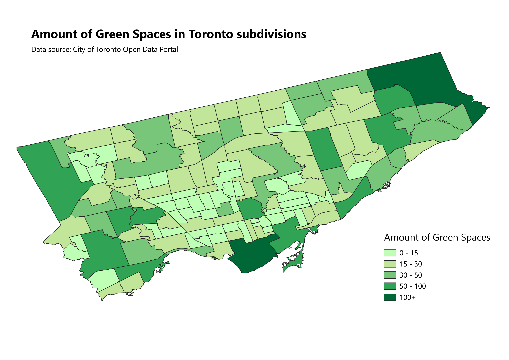

# greenspaces
Data Analysis and Visualisation project. March 2026.

Hello and welcome to my first data analysis project! I used data from the City of Toronto's Open Data Portal and the QGIS software to create two choropleth maps. The first map shows the amount of green spaces in each Toronto census subdivision. The second map shows the percent of green space coverage, also in each Toronto census subdivision. According to Open Data Toronto (2026), green spaces include, but are not limited to: public parks, beaches, parts of ravines, golf courses and cemeteries.

I began this project at the March 26 datathon jointly hosted by the Yorku Data Science Club, Yorku Library Data Services and Toronto Open Data. During the event, I tried a few tools like Tableau and Geopandas, but it didn't go smoothly. Afterwards, a librarian suggested that I use a Geographic Information System (GIS) tool, which made sense since we were working with map data after all. The following is the result. 

